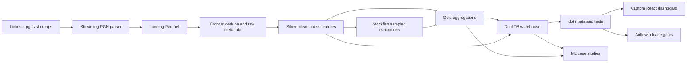
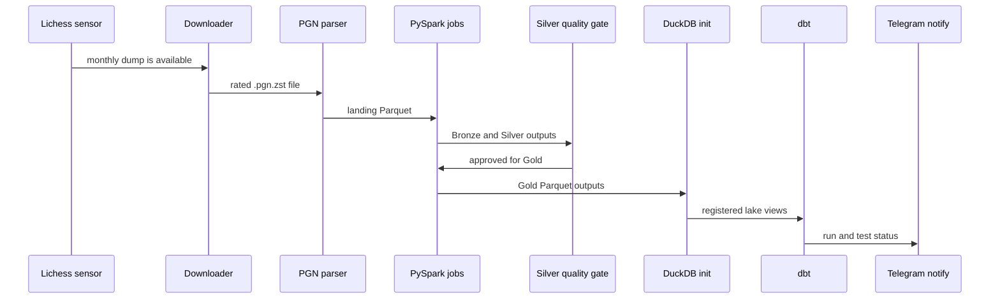

> On a whim, I pushed this project to GitHub

# KnightVision

KnightVision is a chess analytics data platform over the Lichess public database. It is organized as a portfolio-grade data engineering project: monthly dump ingestion, PySpark medallion processing, DuckDB/dbt analytics, Airflow orchestration, custom dashboarding, and ML case studies.

The original web-app direction is intentionally out of scope. This repository is focused on backend, data engineering, and analytics work.

## Architecture



Airflow coordinates the monthly workflow:



## Repository Layout

```text
ingestion/              # Downloader, PGN parser, optional Kafka producer
pipeline/               # PySpark Bronze/Silver/Gold jobs and quality checks
warehouse/              # DuckDB initialization, schema, dashboard queries
analytics/dbt/          # dbt-duckdb project
orchestration/          # Airflow DAGs, sensor plugin, Airflow compose file
dashboard_api/          # FastAPI backend for the custom local dashboard
dashboard_web/          # React/Vite dashboard frontend
dashboard/              # Legacy Streamlit dashboard fallback
notebooks/              # EDA, feature engineering, ML exploration
models/                 # Saved model artifacts
data/                   # Local raw/lake/warehouse artifacts, ignored by git
docs/                   # Operational and portfolio documentation
tests/                  # Unit and integration tests
```

## Feature Overview

See [docs/FEATURES.md](docs/FEATURES.md) for the full list of implemented platform, analytics, dashboard, Stockfish, orchestration, and ML features. See [docs/MODEL_CARDS.md](docs/MODEL_CARDS.md) for model-card summaries of the three ML case studies.

## Local Setup

Prerequisites:

- Python 3.10 or 3.11
- `uv`
- Node.js and npm for the custom React dashboard
- Java 11+ for Spark
- Docker with Docker Compose for Airflow
- Enough disk space for selected Lichess monthly dumps (about 30-100GB for the full rated dump, smaller for bounded benchmarks)
- Optional: a UCI-compatible Stockfish binary for blunder analytics

Install dependencies:

```bash
make setup
```

Optional local overrides live in [.env.example](.env.example). Copy it to `.env` only if you want to centralize values like `KNIGHTVISION_DUCKDB_PATH`, `STOCKFISH_PATH`, or Telegram settings; the normal `make` targets work without it.

Run the local demo pipeline and dbt checks:

```bash
make demo
```

This parses `fixtures/sample_lichess.pgn`, builds the Bronze/Silver/Gold lake under `data/sample`, initializes `warehouse/knightvision_sample.duckdb`, and runs dbt against that sample warehouse.

Run a real monthly flow (! CAUTION WITH LARGE MONTHLY DUMPS !):

```bash
make pipeline MONTH=2024-01
```

Run individual stages:

```bash
make download MONTH=2024-01
make parse MONTH=2024-01
make bronze MONTH=2024-01
make silver MONTH=2024-01
make quality MONTH=2024-01
make gold MONTH=2024-01
make warehouse
make dbt-run
make dbt-test
```

## Running Real Monthly Data

### Choose a month

Lichess dump sizes vary significantly by era. Pick a month that fits your available storage before starting.

| Era | Compressed download | Full pipeline on disk | Games (approx.) |
|---|---:|---:|---:|
| 2013–2015 | 100–500 MB | 1–4 GB | 200K–2M |
| 2016–2017 | 0.5–3 GB | 4–15 GB | 2M–10M |
| 2018–2019 | 3–8 GB | 15–40 GB | 10M–25M |
| 2020–2022 | 8–18 GB | 40–90 GB | 25M–55M |
| 2023–2024 | 18–30 GB | 90–150 GB | 55M–90M |

Full pipeline on disk = landing + bronze + silver Parquet + gold Parquet + DuckDB. Landing and bronze are the two biggest layers; they can be deleted after silver succeeds (see cleanup below).

**Recommended starting point:** one month from 2016–2018 gives millions of real games, takes 10–40 GB total, and validates every pipeline stage end-to-end.

```bash
make pipeline MONTH=2017-06   # ~2 GB compressed, ~12 GB total
```

### Step-by-step with per-layer observability

Run stages individually so you can record metrics at each layer and free intermediate storage as you go.

**Layer 0 — Download**

```bash
make download MONTH=2017-06
ls -lh data/raw/lichess_db_standard_rated_2017-06.pgn.zst
```

Record:

| Layer 0 — Download | |
|---|---|
| File | `data/raw/lichess_db_standard_rated_2017-06.pgn.zst` |
| Compressed size | _(e.g. 2.1 GB)_ |
| Status | ✅ / ❌ |

---

**Layer 1 — Landing Parquet (PGN parser, no Spark)**

```bash
make parse MONTH=2017-06
cat data/quality/2017-06/parser_metrics.json
du -sh data/landing/2017-06/
```

The parser metrics JSON contains `games_written`, `batches`, and `elapsed_seconds`.

| Layer 1 — Landing | |
|---|---|
| Disk size | _(e.g. 8.4 GB)_ |
| Games written | _(from `parser_metrics.json → games_written`)_ |
| Parse time | _(from `parser_metrics.json → elapsed_seconds`)_ |
| Status | ✅ / ❌ |

---

**Layer 2 — Bronze Parquet (PySpark dedup)**

```bash
make bronze MONTH=2017-06
cat data/quality/2017-06/bronze_metrics.json
du -sh data/bronze/2017-06/
```

The bronze metrics JSON contains `input_count`, `output_count`, `duplicate_rows_removed`, `missing_game_id`, and `quarantine_count`.

| Layer 2 — Bronze | |
|---|---|
| Input rows (from landing) | _(from `bronze_metrics.json → input_count`)_ |
| Output rows (deduped) | _(from `bronze_metrics.json → output_count`)_ |
| Duplicates removed | _(from `bronze_metrics.json → duplicate_rows_removed`)_ |
| Quarantined (null game_id) | _(from `bronze_metrics.json → quarantine_count`)_ |
| Disk size | _(e.g. 8.1 GB)_ |
| Status | ✅ / ❌ |

Free the raw download after bronze succeeds:

```bash
rm data/raw/lichess_db_standard_rated_2017-06.pgn.zst
```

---

**Layer 3 — Silver Parquet (PySpark enrichment)**

```bash
make silver MONTH=2017-06
cat data/quality/2017-06/silver_metrics.json   # written by the silver job itself
du -sh data/silver/
```

The silver metrics JSON contains `input_count`, `output_count`, `quarantine_count`, and `elapsed_seconds`.

| Layer 3 — Silver | |
|---|---|
| Input rows (from bronze) | _(from `silver_metrics.json → input_count`)_ |
| Output rows | _(from `silver_metrics.json → output_count`)_ |
| Quarantined (null required cols) | _(from `silver_metrics.json → quarantine_count`)_ |
| Disk size | _(e.g. 7.9 GB)_ |
| Silver runtime | _(from `silver_metrics.json → elapsed_seconds`)_ |
| Status | ✅ / ❌ |

Free landing + bronze after silver succeeds:

```bash
rm -rf data/landing/2017-06 data/bronze/2017-06
```

---

**Layer 4 — Quality gate**

```bash
make quality MONTH=2017-06
cat data/quality/2017-06/quality_metrics.json
```

The quality metrics JSON contains `retention`, `null_counts`, `duplicate_game_ids`, `elo_in_range`, and `anomalies` (populated when a previous month's metrics exist for comparison).

| Layer 4 — Quality gate | |
|---|---|
| Silver retention vs bronze | _(e.g. 99.8%)_ |
| Null game_id | _(should be 0)_ |
| Duplicate game_ids | _(should be 0)_ |
| Elo out of range | _(should be 0)_ |
| Anomalies flagged | _(from `anomalies` list, empty on first run)_ |
| Status | ✅ passed / ❌ failed |

---

**Layer 5 — Gold Parquet (PySpark aggregations)**

```bash
make gold MONTH=2017-06
du -sh data/gold/player_monthly_stats/ data/gold/opening_performance/ data/gold/time_pressure/
```

Gold is Hive-partitioned by `year=YYYY/month=M`. Row counts come from the warehouse after `make warehouse`.

| Layer 5 — Gold | |
|---|---|
| Player monthly stats disk | _(e.g. 45 MB)_ |
| Opening performance disk | _(e.g. 12 MB)_ |
| Time pressure disk | _(e.g. 2 MB)_ |
| Status | ✅ / ❌ |

---

**Layer 6 — DuckDB warehouse + dbt**

```bash
make warehouse
make dbt-run
make dbt-test
ls -lh warehouse/knightvision.duckdb
```

| Layer 6 — Warehouse + dbt | |
|---|---|
| DuckDB file size | _(e.g. 1.2 GB)_ |
| dbt models built | _(e.g. 12)_ |
| dbt tests passed | _(e.g. 7)_ |
| Status | ✅ / ❌ |

---

### End-to-end summary table

Paste this into the **Portfolio Metrics** section of the README after a full successful run:

| Real monthly dump — YYYY-MM | Value |
|---|---:|
| Source | `lichess_db_standard_rated_YYYY-MM.pgn.zst` |
| Compressed download | |
| Landing rows (parsed games) | |
| Bronze rows (after dedup) | |
| Bronze quarantine rows | |
| Silver rows (after enrichment) | |
| Silver quarantine rows | |
| Silver retention | |
| Gold player monthly rows | |
| Gold opening rows | |
| Gold time-pressure rows | |
| DuckDB warehouse size | |
| dbt models built | |
| dbt tests passed | |
| Parser runtime | |
| Bronze runtime | |
| Silver runtime | |
| Quality gate runtime | |
| Gold runtime (sum of 3 jobs) | |
| Machine | |

### Storage cleanup after you're done

To completely free all pipeline data for a month:

```bash
rm -rf data/raw/lichess_db_standard_rated_2017-06.pgn.zst \
       data/landing/2017-06 \
       data/bronze/2017-06 \
       data/silver/2017-06 \
       data/gold/*/year=2017/month=6
```

The DuckDB warehouse (`warehouse/knightvision.duckdb`) and quality JSON artifacts (`data/quality/2017-06/`) are small and worth keeping.

Initialize the DuckDB warehouse:

```bash
make warehouse
```

Run the dashboard on the main warehouse:

```bash
make dashboard
```

The custom dashboard opens at `http://localhost:3636`. It starts a React/Vite frontend on port `3636` and a FastAPI dashboard API on port `3637`.

The dashboard includes Overview, Evidence, Openings, Players, Blunders, Time Pressure, ML Lab, and Quality tabs. Use the warehouse selector in the sidebar to switch between the main, sample, real sample, and benchmark DuckDB files when they exist locally.

Run the dashboard on the deterministic sample warehouse:

```bash
make dashboard-sample
```

The Makefile wraps the longer `uv`, Python 3.11, Spark environment cleanup, `PYTHONPATH`, dashboard ports, and DuckDB path commands. If you need to override them, use variables such as `PYTHON=python`, `DUCKDB_PATH=warehouse/knightvision_benchmark.duckdb`, `DASHBOARD_PORT=3636`, or `MONTH=2026-04`.

The old Streamlit dashboard is still available as a fallback:

```bash
make dashboard-streamlit
```

## Airflow

Start the local Airflow stack:

```bash
make airflow-up
```

The Airflow UI is available at `http://localhost:8080`.

Default local credentials:

- Username: `airflow`
- Password: `airflow`

Useful commands:

```bash
make airflow-logs
make airflow-down
make airflow-smoke
make airflow-notify-test
```

The monthly DAG is `knightvision_monthly_pipeline`. It runs on the 5th of each month at 12:00 UTC and defaults to processing the previous month. For manual runs, pass a `month` value such as:

```json
{"month": "2024-01"}
```

For a tiny Airflow runtime smoke test without downloading a full monthly archive, compress the fixture to the filename the DAG expects, then run task tests with execution date `2024-02-05` so the DAG resolves the batch month as `2024-01`:

```bash
mkdir -p data/raw
zstd -f fixtures/sample_lichess.pgn -o data/raw/lichess_db_standard_rated_2024-01.pgn.zst
make airflow-up
docker compose --env-file .env -f orchestration/docker-compose.airflow.yml exec airflow-scheduler airflow tasks test knightvision_monthly_pipeline parse_to_bronze_parquet 2024-02-05
```

Then run the downstream task IDs in order: `spark_bronze_ingest`, `spark_silver_transform`, `silver_quality_gate`, `spark_gold_player_stats`, `spark_gold_opening_perf`, `spark_gold_time_pressure`, `init_warehouse`, `dbt_run`, and `dbt_test`.

The same proof is wrapped by:

```bash
make airflow-smoke
```

The DAG notification task is disabled by default because the DAG param `notify` defaults to `false`. To test Telegram delivery explicitly after setting `TELEGRAM_BOT_TOKEN` and `TELEGRAM_CHAT_ID` in `.env`, run:

```bash
make airflow-up
make airflow-notify-test
make airflow-down
```

The backfill DAG is `knightvision_backfill_pipeline`. It accepts:

```json
{"start_month": "2024-01", "end_month": "2024-03"}
```

## Data Quality

Silver quality gates are documented in [docs/DATA_QUALITY.md](docs/DATA_QUALITY.md). The minimum operational checks are:

- Silver row count is at least 95% of Bronze row count.
- `game_id`, `white`, `black`, and normalized `result` are non-null.
- Elo values, when present, are in the 400-3500 range.
- Bronze/Silver partitions fail when empty unless `--allow-empty` is passed.
- Required Silver columns and duplicate `game_id` values are checked.
- Parser, Bronze, and Silver diagnostics are written under `data/quality/<month>/` for normal runs.
- Sample diagnostics are written under `data/sample/quality/`.
- dbt tests enforce mart-level uniqueness, accepted values, and relationship checks.

## Current Analytical Scope

Implemented analytics cover parsed Lichess games, Bronze deduplication, Silver normalization/enrichment, opening performance, player monthly stats, clock-based time-pressure buckets, and Stockfish-backed blunder-position generation. When Stockfish rows are present, time-pressure output also includes evaluated position counts, blunder counts, average centipawn loss, and blunder rate by bucket.

Blunder analytics require an external UCI-compatible Stockfish binary and a bounded sampling run. Use `make blunders STOCKFISH_PATH=/path/to/stockfish` for the main lake, or `make sample-blunders STOCKFISH_PATH=/path/to/stockfish` after `make sample-pipeline`. See [docs/STOCKFISH_BLUNDER_ANALYTICS.md](docs/STOCKFISH_BLUNDER_ANALYTICS.md).

The benchmark proof includes a 1,000-game Stockfish sample from the 100 MB monthly prefix. It produced 19,739 evaluated positions and 623 standard 200cp blunders.

Machine learning case studies are documented in [docs/MACHINE_LEARNING.md](docs/MACHINE_LEARNING.md). The current ML layer includes:

- Blunder Prediction Under Time Pressure.
- Opening Outcome Prediction.
- Player Style Clustering.

## Portfolio Metrics

Latest deterministic fixture proof:

| Metric | Value |
|---|---:|
| Fixture month | 2024-01 |
| Fixture games | 3 |
| Bronze rows | 3 |
| Silver rows | 3 |
| Silver retention | 100% |
| Gold player monthly rows | 6 |
| Gold opening rows | 3 |
| Gold time-pressure rows | 3 |
| dbt models built | 12 |
| dbt tests passed | 7 |
| Dashboard query rows | opening 3, player profile 1, time pressure 3 |
| Runtime | Not formally benchmarked |

Latest real Lichess API proof:

| Metric | Value |
|---|---:|
| Source | Lichess public API PGN export for `DrNykterstein` |
| Raw PGN file | `data/raw/real_sample/lichess_user_DrNykterstein_20.pgn` |
| Raw PGN size | 56,033 bytes |
| Raw PGN games | 20 |
| Landing rows | 20 |
| Bronze rows | 20 |
| Silver rows | 20 |
| Silver retention | 100% |
| Gold player monthly rows | 7 |
| Gold opening rows | 18 |
| Gold time-pressure rows | 14 |
| dbt models built | 12 |
| dbt tests passed | 7 |
| Dashboard query rows | opening 10, player profile 3, time pressure 14, blunder 0 |
| Warm parser runtime | 0.47s |
| Spark/dbt stage runtime sum | about 70s |
| Machine | AMD Ryzen 5 6600H, 6 cores / 12 threads, 14 GiB RAM, Java 17 |

Real API proof command source:

```bash
curl -L -H 'Accept: application/x-chess-pgn' \
  'https://lichess.org/api/games/user/DrNykterstein?max=20&clocks=true&opening=true&evals=false' \
  -o data/raw/real_sample/lichess_user_DrNykterstein_20.pgn
```

The real API proof is still small. A bounded real monthly `.pgn.zst` benchmark now exists on a 100 MB prefix of the April 2026 standard archive, but a full uninterrupted monthly dump run is still unmeasured.

| Monthly prefix benchmark | Value |
|---|---:|
| Source | `lichess_db_standard_rated_2026-04.pgn.zst` 100 MB prefix |
| Raw games parsed | 322,789 |
| Bronze rows | 322,789 |
| Silver rows | 322,164 |
| Silver retention | 99.81% |
| Parser runtime | 15.98s |
| Bronze runtime | 14.30s |
| Silver runtime | 257.85s |
| Silver quality runtime | 9.21s |
| dbt run runtime | 5.36s |
| dbt test runtime | 3.26s |
| Gold runtimes | player 9.77s, opening 7.76s, time pressure 7.37s |
| Benchmark warehouse views | silver 322,164, player stats 141,946, opening 9,069, time pressure 56 |

## Development

Release guardrails are documented in [docs/RELEASE_GUARDRAILS.md](docs/RELEASE_GUARDRAILS.md). The CI workflow in `.github/workflows/release-guardrails.yml` runs lint, pytest, the deterministic sample pipeline, and dbt parse/run/test against the sample DuckDB warehouse.

Run checks:

```bash
make lint
make test
```

Generate dbt lineage docs:

```bash
KNIGHTVISION_DUCKDB_PATH=../../warehouse/knightvision_sample.duckdb make dbt-docs
```

Format code:

```bash
make format
```

Generated data under `data/`, dbt artifacts, local virtual environments, and Airflow runtime volumes are ignored by git.
