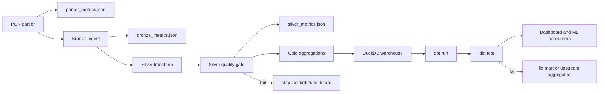

# Data Quality

KnightVision applies quality checks at the Silver layer and again in dbt marts. The goal is to catch corrupted PGN parsing, schema drift, invalid game metadata, and aggregation regressions before dashboard or ML consumers read the data.



## Silver Quality Gate

The Airflow task `silver_quality_gate` runs after Silver transformation and before any Gold aggregation. It is expected to call:

```bash
python -m pipeline.silver.quality_checks \
  --bronze-batch-id YYYY-MM \
  --silver-month YYYY-MM \
  --bronze data/bronze/games \
  --silver data/silver/games \
  --metrics-output data/quality/YYYY-MM/silver_metrics.json
```

The `make quality MONTH=YYYY-MM` target uses the same explicit Bronze batch and Silver month selectors.

Required checks:

| Check | Rule | Failure Meaning |
|---|---|---|
| Row retention | Silver rows >= 95% of Bronze rows | Parser or cleaning logic dropped too much data |
| Game identifiers | `game_id` null count = 0 | Cannot deduplicate or join facts |
| Players | `white` and `black` null count = 0 | Core game metadata is incomplete |
| Result | normalized `result` in `white_win`, `black_win`, `draw` | Result mapping drifted or input was malformed |
| Elo range | nullable Elo values between 400 and 3500 | Cast logic or source metadata is invalid |
| Date partitions | `year` and `month` match `game_date` | Partition pruning and monthly reruns are unsafe |
| Move parsing | `game_length` >= 0 and agrees with `moves_uci` length when moves are parsed | PGN-to-UCI conversion is inconsistent |
| Duplicate IDs | Silver duplicate `game_id` group count = 0 | Deduplication regressed or partition overwrite is unsafe |
| Empty data | Bronze and Silver are non-empty unless `--allow-empty` is explicit | A scheduled run silently processed no data |

## Parser And Bronze Diagnostics

The parser and Bronze job can write release diagnostics before Silver runs:

```bash
python -m ingestion.pgn_parser \
  --input data/raw/lichess_db_standard_rated_YYYY-MM.pgn.zst \
  --output data/landing/games/YYYY-MM \
  --batch-id YYYY-MM \
  --metrics-output data/quality/YYYY-MM/parser_metrics.json

python -m pipeline.bronze.ingest \
  --input data/landing/games/YYYY-MM \
  --output data/bronze/games \
  --metrics-output data/quality/YYYY-MM/bronze_metrics.json
```

Parser metrics include:

- games seen.
- rows written.
- missing game IDs.
- missing players.
- missing result.
- missing moves.
- parse errors.
- suspicious row total.

Bronze metrics include:

- raw input row count.
- rows missing `game_id`.
- duplicate `game_id` groups.
- duplicate rows removed.
- output row count.
- rows removed.
- row counts by `batch_id` and `source`.

Recommended warning metrics:

- Null rate by column.
- Corrupted PGN count.
- Bot-game filter count.
- Unrated-game filter count.
- Clock annotation coverage.
- Distribution of time-control categories.

## dbt Tests

dbt should validate analyst-facing models after Gold aggregation:

| Model Area | Tests |
|---|---|
| Staging games | `game_id` not null and unique, accepted normalized results |
| Staging players | player identifier not null |
| Opening marts | ECO code not null where available, accepted time-control categories |
| Player profile marts | unique player/month grain |
| Time pressure marts | seconds bucket and phase not null |

Custom dbt tests expected in `analytics/dbt/tests/`:

- `assert_no_null_game_id.sql`
- `assert_elo_range.sql`

## Operational Response

If a Silver gate fails:

1. Stop downstream Gold/dbt/dashboard tasks for that run.
2. Inspect row counts by partition and parser rejection logs.
3. Compare Bronze and Silver schema for the failed month.
4. Re-run only the failed month after fixing parser or transform logic.

If dbt tests fail:

1. Keep generated Gold Parquet as diagnostic input.
2. Inspect the failing model grain and accepted values.
3. Fix SQL model logic or upstream Gold aggregation.
4. Re-run `make dbt-run && make dbt-test`.

## Rerun And Rejected-Record Policy

Current pipeline writes are partition-replacement oriented: Spark jobs use overwrite mode for the target lake path or partitioned output. A production rerun should therefore be treated as replacing the affected month/batch, not appending duplicate records.

Operational rules:

- Use a stable `batch_id` for the rerun, usually `YYYY-MM` for monthly dumps.
- Run parser diagnostics before Bronze and keep `parser_metrics.json` with the run artifacts.
- Run Bronze diagnostics and confirm duplicate removals before Silver.
- Run Silver quality with explicit selectors:

```bash
python -m pipeline.silver.quality_checks \
  --bronze-batch-id YYYY-MM \
  --silver-month YYYY-MM \
  --bronze data/bronze/games \
  --silver data/silver/games \
  --metrics-output data/quality/YYYY-MM/silver_metrics.json
```

Rejected or suspicious records are currently counted, not persisted as replayable quarantine rows. The existing metrics capture missing game IDs, missing players, missing results, missing moves, parser errors, duplicate IDs, invalid Silver values, and retention loss. If record-level replay becomes a hard production requirement, add a dedicated `data/quarantine/<batch_id>/` output that stores rejected rows with `reason`, `stage`, `batch_id`, and raw payload.

## Reporting

Each successful monthly run should publish:

- Month processed.
- Bronze, Silver, and Gold row counts.
- Silver retention percentage.
- Null-rate summary for required fields.
- Parser metrics JSON.
- Bronze dedupe metrics JSON.
- Silver metrics JSON.
- Runtime by stage.
- Input compressed size.
- Any skipped/rejected record counts. Quarantine row output is not implemented yet.
