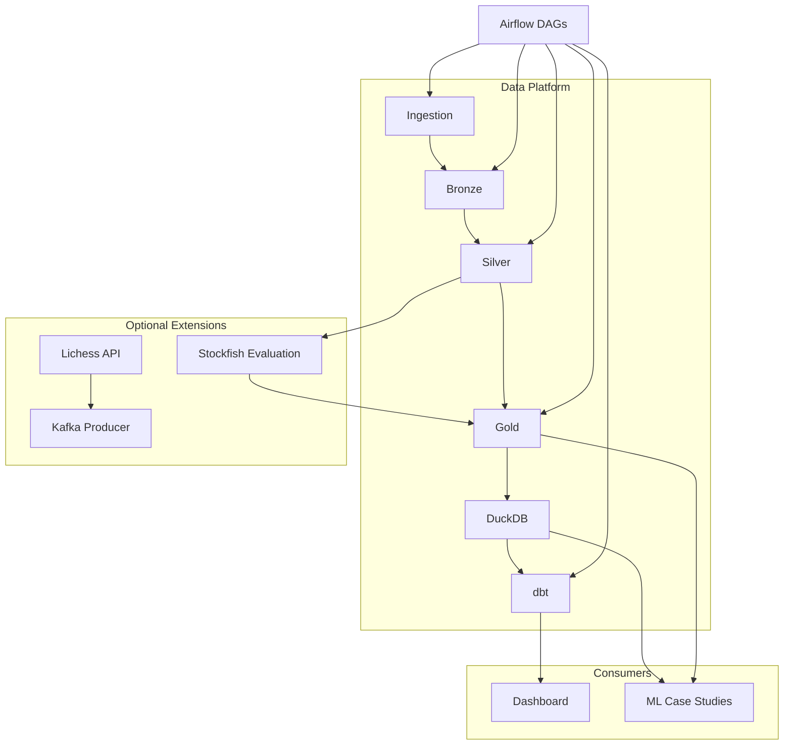
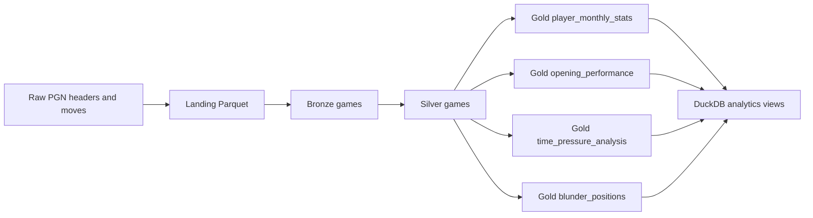

# KnightVision Features

KnightVision is a local chess analytics data platform built around Lichess public data. It covers batch ingestion, Medallion processing, analytics modeling, dashboarding, orchestration, Stockfish analysis, and ML case studies.

## Data Ingestion

- Downloads Lichess monthly `.pgn.zst` archives.
- Streams compressed PGN without full decompression.
- Parses PGN headers, moves, clocks, ECO/opening metadata, Elo, result, players, and source metadata.
- Writes structured Parquet landing data.
- Emits parser diagnostics for missing IDs, missing players, missing results, missing moves, parse errors, and suspicious row counts.
- Includes an optional Kafka producer scaffold for Lichess API streams.

## Medallion Pipeline

### Bronze

- Reads landing Parquet.
- Preserves raw game metadata.
- Extracts stable game IDs.
- Removes duplicate rows.
- Emits Bronze quality metrics.

### Silver

- Normalizes result, dates, Elo, time controls, termination, and openings.
- Converts SAN/PGN moves into UCI move arrays with `python-chess`.
- Parses clock annotations.
- Detects bot games.
- Supports corrupt, unrated, and bot-game filters.
- Adds chess behavior fields: game length, legal prefix length, capture count, castling flags, clock coverage, result reason, opening family, and opening variation.

### Gold

- Player monthly stats.
- Opening performance by ECO, Elo bucket, time control, and year.
- Time-pressure analysis by clock bucket and game phase.
- Stockfish-evaluated blunder positions.

## Data Quality

- Parser diagnostics JSON.
- Bronze duplicate and missing-ID diagnostics.
- Silver quality gate for retention, required columns, nulls, Elo bounds, invalid results, duplicate game IDs, and partition filtering.
- dbt tests for warehouse models.
- Release guardrail commands for lint, tests, sample pipeline, and dbt.

See [DATA_QUALITY.md](DATA_QUALITY.md) for the full data quality reference.

## Warehouse And dbt

- DuckDB warehouse over Parquet lake data.
- Views over Silver and Gold outputs.
- dbt-duckdb project with staging, intermediate, dimension, and mart models.
- dbt tests for core analytical expectations.
- Dashboard-facing SQL queries.

## Dashboard

The primary dashboard is a custom local React + FastAPI app:

- Overview page.
- Evidence page for production-readiness proof points, warehouse coverage, quality status, and ML artifact availability.
- Opening Explorer.
- Player Profiles.
- Blunder Map.
- Time Pressure Analysis.
- ML Lab for saved model artifacts.
- Data Quality / Pipeline Status page.
- In-dashboard warehouse selector for main, sample, real sample, and benchmark DuckDB files.
- Custom chess-themed styling using board-square colors, green/cream/gold accents, dark analysis panels, responsive cards, animated transitions, and a CSS chessboard heatmap.
- Sample and main warehouse launch targets through `make dashboard-sample` and `make dashboard`.

The dashboard reads from DuckDB through a FastAPI backend and can run against sample, real sample, or benchmark warehouses. The legacy Streamlit app is still available with `make dashboard-streamlit`.

## Stockfish Blunder Analytics

- Generates FEN positions from legal move sequences.
- Evaluates sampled positions with Stockfish.
- Computes centipawn loss.
- Flags 200cp blunders.
- Writes `gold/blunder_positions`.
- Feeds blunder metrics back into time-pressure analysis when available.

See [STOCKFISH_BLUNDER_ANALYTICS.md](STOCKFISH_BLUNDER_ANALYTICS.md) for runtime controls and test strategy.

## Machine Learning

### Blunder Prediction Under Time Pressure

- Binary XGBoost classifier.
- Predicts whether a Stockfish-evaluated move is a 200cp blunder.
- Includes baselines, threshold analysis, ROC/PR curves, feature importance, and model card.
- Dashboard ML Lab integration shows metrics, plots, threshold artifacts, and feature importance from `models/blunder_predictor`.

### Opening Outcome Prediction

- Three-class XGBoost classifiers.
- Pre-game model predicts white win, black win, or draw from Elo, opening, time control, and date.
- Post-game model is diagnostic and uses parsed move metadata.
- Includes baselines, confusion matrices, per-class F1, feature importance, and model cards.
- Dashboard ML Lab integration compares pre-game and post-game artifacts.

### Player Style Clustering

- Unsupervised KMeans clustering.
- Builds player behavior profiles from Silver games.
- Produces statistical personas such as Blitz Specialists, Opening Explorers, and Long-Game Grinders.
- Includes cluster sweep, silhouette/elbow plots, PCA scatter, cluster profiles, and model card.
- Dashboard ML Lab integration shows cluster profiles, player assignment samples, and cluster plots.

## Orchestration

- Airflow monthly pipeline DAG.
- Airflow backfill DAG.
- Custom Lichess dump sensor.
- DuckDB warehouse initialization before dbt.
- Optional Telegram notification.

See [RELEASE_GUARDRAILS.md](RELEASE_GUARDRAILS.md) for release and smoke-test commands.

## Reproducible Evidence

The project has been proven on:

- Deterministic 3-game fixture.
- Real 20-game Lichess API sample.
- 100 MB monthly `.pgn.zst` prefix benchmark.
- 1,000-game Stockfish sample from benchmark data.
- Three ML artifact pipelines.

## Current Limits

The project is not yet fully production-proven for:

- Full uninterrupted monthly `.pgn.zst` archive.
- Historical multi-year backfill.
- Deployed production dashboard.
- Scheduled ML retraining.
- Model registry or artifact versioning.
- Drift monitoring.
- DVC/data artifact tracking.
