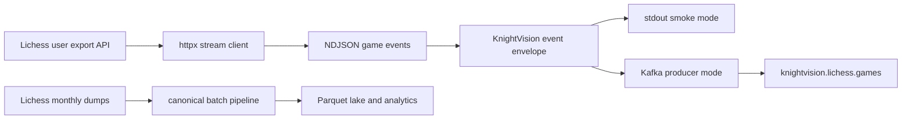

# Optional Kafka Producer

Kafka is not required for KnightVision's production-ready batch pipeline. The core path remains monthly Lichess dump ingestion through Parquet, Spark, DuckDB, dbt, and Streamlit.

`ingestion/kafka_producer.py` is an optional portfolio/streaming scaffold for near-real-time Lichess API events.



## Stdout Smoke Test

Use stdout mode first. It does not require a Kafka broker or Kafka Python package:

```bash
UV_CACHE_DIR=/tmp/uv-cache UV_PYTHON_INSTALL_DIR=/tmp/uv-python uv run --python 3.11 python -m ingestion.kafka_producer \
  --user DrNykterstein \
  --max-events 3
```

This prints one JSON envelope per event:

```json
{"key": "game-id", "topic": "knightvision.lichess.games", "value": {"source": "lichess_api", "ingested_at": "...", "event": {}}}
```

## Kafka Mode

Kafka publishing is enabled only when `--bootstrap-servers` is passed. The project does not pin a Kafka client in the base dependencies; install `kafka-python` separately in the environment where you want to publish:

```bash
python -m pip install kafka-python
python -m ingestion.kafka_producer \
  --users alice,bob \
  --topic knightvision.lichess.games \
  --bootstrap-servers localhost:9092 \
  --max-events 100
```

Optional Lichess API token:

```bash
python -m ingestion.kafka_producer \
  --user some_user \
  --token "$LICHESS_TOKEN" \
  --bootstrap-servers localhost:9092
```

## Design Notes

- The producer consumes Lichess NDJSON endpoints.
- Each Kafka message key is the Lichess game id when available.
- Each message value includes `source`, `ingested_at`, and the raw Lichess event.
- The module avoids hard Kafka dependencies so normal tests and the batch pipeline remain lightweight.
- This producer is not wired into the monthly Airflow DAG; monthly bulk dumps remain the canonical source for reproducible analytics.
