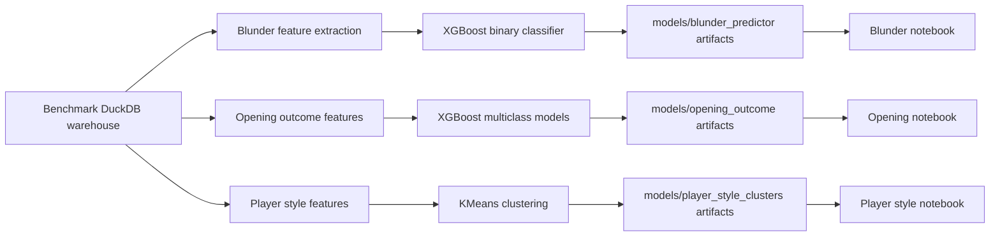

# Machine Learning

KnightVision includes three reproducible ML case studies over the benchmark DuckDB warehouse. Each pipeline writes metrics, plots, saved preprocessing/model artifacts, and a `model_card.md` with interpretation and limitations. A consolidated project-level summary is available in [MODEL_CARDS.md](MODEL_CARDS.md).

Default source:

```text
warehouse/knightvision_benchmark.duckdb
```



## Blunder Prediction Under Time Pressure

This is a binary XGBoost classifier trained from Stockfish-evaluated positions. It predicts whether a move is a standard 200cp blunder.

Run:

```bash
make train-blunder-model
```

Artifacts under `models/blunder_predictor/`:

- `model.json`
- `preprocessing.joblib`
- `metrics.json`
- `model_card.md`
- `threshold_metrics.csv`
- `precision_recall_curve.png`
- `roc_curve.png`
- `threshold_tradeoff.png`
- `feature_importance.csv`
- `feature_importance.png`
- `evaluation_report.md`

Latest proof (December 2016, 1,000-game Stockfish sample):

| Metric | Value |
|---|---:|
| Evaluated positions | 59,667 |
| 200cp blunder rows | 4,342 |
| Training rows | 47,733 |
| Test rows | 11,934 |
| ROC-AUC | 0.6884 |
| PR-AUC | 0.1372 |
| Recall | 0.6901 |
| Precision | 0.1102 |
| F1 | 0.1900 |

Baseline context: majority-class baseline has ROC-AUC `0.5000`, PR-AUC `0.0727`, F1 `0.0000`. This model improves ranking quality for rare-event screening. The 2016 dataset has no clock data, so `time_remaining_seconds` is null for all rows; the model learns from phase, material, Elo, and square instead.

## Opening Outcome Prediction

This is a three-class XGBoost case study for `white_win`, `black_win`, and `draw`.

- `pre_game`: honest prediction model using Elo, opening, time control, and date.
- `post_game`: diagnostic model that also uses parsed move metadata after the game has happened.

Run:

```bash
make train-opening-outcome
```

Artifacts under `models/opening_outcome/`:

- `pre_game/` model, preprocessing, label encoder, metrics, confusion matrix, feature importance, and model card.
- `post_game/` equivalent artifacts.
- `comparison_metrics.csv`
- `comparison_report.md`

Latest proof (December 2016, 9.4M games):

| Model | Rows | Accuracy | Balanced Acc | Macro F1 | Weighted F1 | Log Loss |
|---|---:|---:|---:|---:|---:|---:|
| Pre-game | 9,431,205 | 0.4769 | 0.4523 | 0.4012 | 0.5364 | 1.0195 |
| Post-game | 9,431,205 | 0.7115 | 0.7106 | 0.5970 | 0.7515 | 0.7568 |

Elo-favorite baseline for comparison: accuracy 0.6143, balanced accuracy 0.4267. The pre-game model beats class-prior on balanced accuracy but trails the Elo-favorite rule on raw accuracy — expected given that Elo is a strong predictor by itself. The post-game model improves substantially by incorporating move metadata, but remains a diagnostic study, not a deployable predictor.

## Player Style Clustering

This is an unsupervised KMeans case study. It builds one behavior profile per player from Silver games and clusters players into statistical personas.

Run:

```bash
make cluster-player-styles
```

Artifacts under `models/player_style_clusters/`:

- `cluster_profiles.csv`
- `cluster_sweep.csv`
- `metrics.json`
- `model_card.md`
- `cluster_scatter.png`
- `feature_profiles.png`
- `elbow_plot.png`
- `silhouette_by_k.png`
- `evaluation_report.md`
- `preprocessing.joblib`
- `kmeans.joblib`
- `pca.joblib`

`cluster_assignments.csv` is generated locally but ignored by git because it contains public player identifiers.

Latest proof (December 2016, 9.4M games):

| Metric | Value |
|---|---:|
| Eligible players (≥10 games) | 130,863 |
| Clusters | 5 |
| Silhouette score | 0.1827 |
| PCA explained variance, 2D | 0.3897 |

Generated style labels:

- Opening Explorers
- Long-Game Grinders
- Opening Loyalists
- Balanced Generalists
- Bullet Specialists

These labels are unsupervised statistical personas from available behavior features, not ground-truth chess identities.

## Current ML Limits

- No model registry or artifact versioning.
- No drift monitoring between monthly runs.
- Cluster labels are hand-assigned after inspection; they are not validated against external ground truth.
