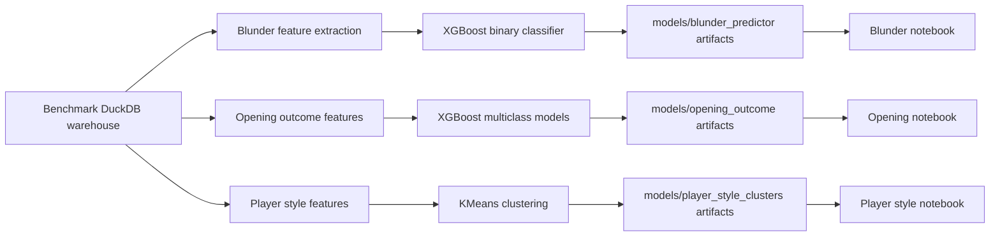

# Machine Learning

KnightVision includes three reproducible ML case studies over the benchmark DuckDB warehouse. Each pipeline writes metrics, plots, saved preprocessing/model artifacts, and a `model_card.md` with interpretation and limitations. A consolidated project-level summary is available in [MODEL_CARDS.md](MODEL_CARDS.md).

Default source:

```text
warehouse/knightvision_benchmark.duckdb
```



## Blunder Prediction Under Time Pressure

This is a binary XGBoost classifier trained from Stockfish-evaluated positions. It predicts whether a move is a standard 200cp blunder.

Run:

```bash
make train-blunder-model
```

Artifacts under `models/blunder_predictor/`:

- `model.json`
- `preprocessing.joblib`
- `metrics.json`
- `model_card.md`
- `threshold_metrics.csv`
- `precision_recall_curve.png`
- `roc_curve.png`
- `threshold_tradeoff.png`
- `feature_importance.csv`
- `feature_importance.png`
- `evaluation_report.md`

Latest benchmark proof:

| Metric | Value |
|---|---:|
| Training rows | 19,739 |
| 200cp blunder rows | 623 |
| ROC-AUC | 0.7558 |
| PR-AUC | 0.1009 |
| Recall | 0.5680 |
| Precision | 0.0773 |
| F1 | 0.1361 |

Baseline context: the majority-class baseline has ROC-AUC `0.5000`, PR-AUC `0.0317`, and F1 `0.0000`. This model mainly improves ranking quality for rare-event screening.

## Opening Outcome Prediction

This is a three-class XGBoost case study for `white_win`, `black_win`, and `draw`.

- `pre_game`: honest prediction model using Elo, opening, time control, and date.
- `post_game`: diagnostic model that also uses parsed move metadata after the game has happened.

Run:

```bash
make train-opening-outcome
```

Artifacts under `models/opening_outcome/`:

- `pre_game/` model, preprocessing, label encoder, metrics, confusion matrix, feature importance, and model card.
- `post_game/` equivalent artifacts.
- `comparison_metrics.csv`
- `comparison_report.md`

Latest benchmark proof:

| Model | Rows | Accuracy | Balanced Accuracy | Macro F1 | Weighted F1 | Log Loss |
|---|---:|---:|---:|---:|---:|---:|
| Pre-game | 322,164 | 0.3608 | 0.3981 | 0.3156 | 0.4195 | 1.0689 |
| Post-game diagnostic | 322,164 | 0.7584 | 0.7389 | 0.6245 | 0.8028 | 0.7664 |

Interpretation: the pre-game model is a weak-signal baseline. It improves balanced accuracy over class-prior prediction, but its raw accuracy is lower than the Elo-favorite rule. The post-game model is stronger but must not be presented as a pre-game predictor.

## Player Style Clustering

This is an unsupervised KMeans case study. It builds one behavior profile per player from Silver games and clusters players into statistical personas.

Run:

```bash
make cluster-player-styles
```

Artifacts under `models/player_style_clusters/`:

- `cluster_profiles.csv`
- `cluster_sweep.csv`
- `metrics.json`
- `model_card.md`
- `cluster_scatter.png`
- `feature_profiles.png`
- `elbow_plot.png`
- `silhouette_by_k.png`
- `evaluation_report.md`
- `preprocessing.joblib`
- `kmeans.joblib`
- `pca.joblib`

`cluster_assignments.csv` is generated locally but ignored by git because it contains public player identifiers.

Latest benchmark proof:

| Metric | Value |
|---|---:|
| Eligible players, minimum 10 games | 15,566 |
| Clusters | 5 |
| Silhouette score | 0.1372 |
| PCA explained variance, 2D | 0.3015 |

Generated style labels:

- Blitz Specialists
- Opening Loyalists
- Opening Explorers
- Long-Game Grinders
- Sharp Tactical Players

These labels are unsupervised statistical personas from available behavior features, not ground-truth chess identities.

## Current ML Limits

- No scheduled retraining DAG yet.
- No model registry or artifact versioning.
- Custom dashboard integration reads saved metrics, reports, plots, feature importance, cluster profiles, and sample assignments from `models/`.
- No online inference API.
- No drift monitoring.
