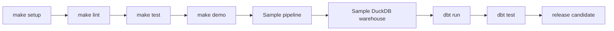

# Release Guardrails

KnightVision is release-ready only when the same checks pass locally and in CI. These guardrails are intentionally small enough to run on every change while still proving the pipeline, warehouse, and dbt path.



## Required Local Check

Use the Makefile targets from the repository root. They wrap `uv`, Python 3.11, dbt, and the Spark environment cleanup used by this project:

```bash
make setup
make lint
make test
make demo
```

`make demo` runs the deterministic fixture pipeline, initializes `warehouse/knightvision_sample.duckdb`, and runs dbt against that sample warehouse.

## Airflow Smoke Check

The pytest suite imports both DAG modules and asserts that the monthly DAG keeps the critical release gates:

- `silver_quality_gate`
- `init_warehouse`
- `dbt_run`
- `dbt_test`
- `notify_telegram`

For a manual import check:

```bash
UV_CACHE_DIR=/tmp/uv-cache UV_PYTHON_INSTALL_DIR=/tmp/uv-python UV_LINK_MODE=copy uv run --python 3.11 python - <<'PY'
from orchestration.dags.monthly_pipeline import dag as monthly
from orchestration.dags.backfill_pipeline import dag as backfill

print(monthly.dag_id, len(monthly.tasks))
print(backfill.dag_id, len(backfill.tasks))
PY
```

## Quality Artifacts

Pipeline runs should leave JSON diagnostics under `data/quality/<YYYY-MM>/`:

- `parser_metrics.json`: raw PGN parser diagnostics.
- `bronze_metrics.json`: dropped missing IDs, duplicate IDs, and partition counts.
- `silver_metrics.json`: retention, null counts, invalid values, clock coverage, result counts, and partition counts.

The deterministic fixture path writes Silver metrics under `data/sample/quality/silver_quality.json`.

DuckDB warehouse initialization is a release gate. The full `make pipeline` target and the monthly Airflow DAG must run `warehouse/init_db.py` after Gold outputs and before dbt, so dbt never reads stale or missing lake views.

## dbt Docs

Generate lineage docs after the sample warehouse has been initialized:

```bash
cd analytics/dbt
KNIGHTVISION_DUCKDB_PATH=../../warehouse/knightvision_sample.duckdb \
  UV_CACHE_DIR=/tmp/uv-cache UV_PYTHON_INSTALL_DIR=/tmp/uv-python UV_LINK_MODE=copy \
  uv run --python 3.11 dbt docs generate --profiles-dir .
cd ../..
```

Generated dbt files stay under ignored `analytics/dbt/target/`; publish screenshots or exported artifacts separately if needed for a portfolio.
