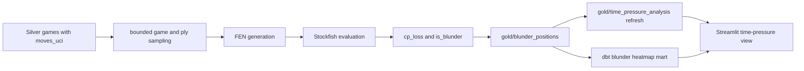

# Stockfish Blunder Analytics

KnightVision supports engine-backed blunder position generation through `pipeline.gold.blunder_positions`.



## What The Job Produces

The job reads Silver games with legal `moves_uci` arrays and writes `gold/blunder_positions` rows with:

- `game_id`
- `ply_number`
- `fen`
- `move_uci`
- destination `square`
- `game_phase`
- `time_control_type`
- `year`
- `player_elo`
- `time_remaining_seconds`
- `material_balance`
- `is_in_check`
- `eval_before_cp`
- `eval_after_cp`
- `cp_loss`
- `is_blunder`

`cp_loss` is computed from the mover's point of view:

```text
cp_loss = max(0, eval_before_cp - eval_after_cp)
```

Rows are marked as blunders when `cp_loss >= --blunder-threshold-cp`, defaulting to `200`.

## Running Locally

Install a UCI-compatible Stockfish binary and pass its path explicitly. Prefer the Make target for normal runs because it also refreshes time-pressure metrics:

```bash
make blunders STOCKFISH_PATH=/usr/bin/stockfish
```

For direct module execution:

```bash
python -m pipeline.gold.blunder_positions \
  --input data/silver/games \
  --output data/gold/blunder_positions \
  --stockfish-path /usr/bin/stockfish \
  --fraction 0.01 \
  --max-games 1000 \
  --max-plies 80 \
  --depth 12
```

For faster smoke runs, prefer bounded settings:

```bash
make sample-blunders STOCKFISH_PATH=/usr/bin/stockfish
```

Both Make targets require an explicit `STOCKFISH_PATH` and keep the normal `make gold` path lightweight.

Both targets also recompute `gold/time_pressure_analysis` with the generated blunder rows. When evaluated
positions overlap clock buckets, `avg_cp_loss`, `blunder_rate`, `evaluated_positions`, and `blunder_count`
are populated in the time-pressure output. Without Stockfish rows, those quality metrics remain null/zero
and the dashboard falls back to clock bucket counts.

## Runtime Controls

- `--fraction`: game sampling fraction, `(0, 1]`.
- `--max-games`: hard cap after sampling.
- `--max-plies`: max plies evaluated per game.
- `--depth`: Stockfish search depth.
- `--movetime-ms`: wall-clock search time per position; overrides depth when set.
- `--blunder-threshold-cp`: centipawn loss threshold for `is_blunder`.

The Spark implementation opens one Stockfish process per partition, not one per row.

## Test Strategy

The default test suite does not require Stockfish. It validates FEN generation, phase/material features, cp-loss logic, illegal-move handling, and engine-path validation through pure helpers and a fake evaluator.

Real Stockfish execution should be tested separately on a small bounded sample before claiming production run metrics.
